<!-- markdownlint-capture -->
<!-- markdownlint-disable -->

# Code Metrics

This file is dynamically maintained by a bot, *please do not* edit this by hand. It represents various [code metrics](https://aka.ms/dotnet/code-metrics), such as cyclomatic complexity, maintainability index, and so on.

## Service.AddressBook.Client :heavy_check_mark:

The *Service.AddressBook.Client.csproj* project file contains:

- 1 namespaces.
- 2 named types.
- 26 total lines of source code.
- Approximately 3 lines of executable code.
- The highest cyclomatic complexity is 1 :heavy_check_mark:.

  <strong id="service-addressbook-client">
    Service.AddressBook.Client :heavy_check_mark:
  </strong>

 

The `Service.AddressBook.Client` namespace contains 2 named types.

- 2 named types.
- 26 total lines of source code.
- Approximately 3 lines of executable code.
- The highest cyclomatic complexity is 1 :heavy_check_mark:.

  <strong id="addressbookclientfactory">
    AddressBookClientFactory :heavy_check_mark:
  </strong>

 

- The `AddressBookClientFactory` contains 2 members.
- 9 total lines of source code.
- Approximately 1 lines of executable code.
- The highest cyclomatic complexity is 1 :heavy_check_mark:.

| Member kind | Line number | Maintainability index | Cyclomatic complexity | Depth of inheritance | Class coupling | Lines of source / executable code |
| :-: | :-: | :-: | :-: | :-: | :-: | :-: |
| Method | <a href='https://github.com/MyJetWallet/Service.AddressBook/blob/master/src/Service.AddressBook.Client/AddressBookClientFactory.cs#L10' title='AddressBookClientFactory.AddressBookClientFactory(string grpcServiceUrl)'>10</a> | 100 | 1 :heavy_check_mark: | 0 | 1 | 3 / 0 |
| Method | <a href='https://github.com/MyJetWallet/Service.AddressBook/blob/master/src/Service.AddressBook.Client/AddressBookClientFactory.cs#L14' title='IHelloService AddressBookClientFactory.GetHelloService()'>14</a> | 100 | 1 :heavy_check_mark: | 0 | 2 | 1 / 1 |

<a href="#AddressBookClientFactory-class-diagram">:link: to `AddressBookClientFactory` class diagram</a>

<a href="#service-addressbook-client">:top: back to Service.AddressBook.Client</a>

  <strong id="autofachelper">
    AutofacHelper :heavy_check_mark:
  </strong>

 

- The `AutofacHelper` contains 1 members.
- 9 total lines of source code.
- Approximately 2 lines of executable code.
- The highest cyclomatic complexity is 1 :heavy_check_mark:.

| Member kind | Line number | Maintainability index | Cyclomatic complexity | Depth of inheritance | Class coupling | Lines of source / executable code |
| :-: | :-: | :-: | :-: | :-: | :-: | :-: |
| Method | <a href='https://github.com/MyJetWallet/Service.AddressBook/blob/master/src/Service.AddressBook.Client/AutofacHelper.cs#L10' title='void AutofacHelper.RegisterAddressBookClient(ContainerBuilder builder, string grpcServiceUrl)'>10</a> | 84 | 1 :heavy_check_mark: | 0 | 4 | 6 / 2 |

<a href="#AutofacHelper-class-diagram">:link: to `AutofacHelper` class diagram</a>

<a href="#service-addressbook-client">:top: back to Service.AddressBook.Client</a>

<a href="#service-addressbook-client">:top: back to Service.AddressBook.Client</a>

## Service.AddressBook.Domain.Models :heavy_check_mark:

The *Service.AddressBook.Domain.Models.csproj* project file contains:

- 1 namespaces.
- 1 named types.
- 7 total lines of source code.
- Approximately 0 lines of executable code.
- The highest cyclomatic complexity is 2 :heavy_check_mark:.

  <strong id="service-addressbook-domain-models">
    Service.AddressBook.Domain.Models :heavy_check_mark:
  </strong>

 

The `Service.AddressBook.Domain.Models` namespace contains 1 named types.

- 1 named types.
- 7 total lines of source code.
- Approximately 0 lines of executable code.
- The highest cyclomatic complexity is 2 :heavy_check_mark:.

  <strong id="ihellomessage">
    IHelloMessage :heavy_check_mark:
  </strong>

 

- The `IHelloMessage` contains 1 members.
- 4 total lines of source code.
- Approximately 0 lines of executable code.
- The highest cyclomatic complexity is 2 :heavy_check_mark:.

| Member kind | Line number | Maintainability index | Cyclomatic complexity | Depth of inheritance | Class coupling | Lines of source / executable code |
| :-: | :-: | :-: | :-: | :-: | :-: | :-: |
| Property | <a href='https://github.com/MyJetWallet/Service.AddressBook/blob/master/src/Service.AddressBook.Domain.Models/IHelloMessage.cs#L7' title='string IHelloMessage.Message'>7</a> | 100 | 2 :heavy_check_mark: | 0 | 0 | 1 / 0 |

<a href="#IHelloMessage-class-diagram">:link: to `IHelloMessage` class diagram</a>

<a href="#service-addressbook-domain-models">:top: back to Service.AddressBook.Domain.Models</a>

<a href="#service-addressbook-domain-models">:top: back to Service.AddressBook.Domain.Models</a>

## Service.AddressBook.Domain :question:

The *Service.AddressBook.Domain.csproj* project file contains:

- 0 namespaces.
- 0 named types.
- 0 total lines of source code.
- Approximately 0 lines of executable code.
- The highest cyclomatic complexity is 0 :question:.

<a href="#service-addressbook-domain">:top: back to Service.AddressBook.Domain</a>

## Service.AddressBook.Grpc :heavy_check_mark:

The *Service.AddressBook.Grpc.csproj* project file contains:

- 2 namespaces.
- 3 named types.
- 27 total lines of source code.
- Approximately 4 lines of executable code.
- The highest cyclomatic complexity is 2 :heavy_check_mark:.

  <strong id="service-addressbook-grpc">
    Service.AddressBook.Grpc :heavy_check_mark:
  </strong>

 

The `Service.AddressBook.Grpc` namespace contains 1 named types.

- 1 named types.
- 9 total lines of source code.
- Approximately 0 lines of executable code.
- The highest cyclomatic complexity is 1 :heavy_check_mark:.

  <strong id="ihelloservice">
    IHelloService :heavy_check_mark:
  </strong>

 

- The `IHelloService` contains 1 members.
- 6 total lines of source code.
- Approximately 0 lines of executable code.
- The highest cyclomatic complexity is 1 :heavy_check_mark:.

| Member kind | Line number | Maintainability index | Cyclomatic complexity | Depth of inheritance | Class coupling | Lines of source / executable code |
| :-: | :-: | :-: | :-: | :-: | :-: | :-: |
| Method | <a href='https://github.com/MyJetWallet/Service.AddressBook/blob/master/src/Service.AddressBook.Grpc/IHelloService.cs#L11' title='Task<HelloMessage> IHelloService.SayHelloAsync(HelloRequest request)'>11</a> | 100 | 1 :heavy_check_mark: | 0 | 4 | 2 / 0 |

<a href="#IHelloService-class-diagram">:link: to `IHelloService` class diagram</a>

<a href="#service-addressbook-grpc">:top: back to Service.AddressBook.Grpc</a>

  <strong id="service-addressbook-grpc-models">
    Service.AddressBook.Grpc.Models :heavy_check_mark:
  </strong>

 

The `Service.AddressBook.Grpc.Models` namespace contains 2 named types.

- 2 named types.
- 18 total lines of source code.
- Approximately 4 lines of executable code.
- The highest cyclomatic complexity is 2 :heavy_check_mark:.

  <strong id="hellomessage">
    HelloMessage :heavy_check_mark:
  </strong>

 

- The `HelloMessage` contains 1 members.
- 6 total lines of source code.
- Approximately 2 lines of executable code.
- The highest cyclomatic complexity is 2 :heavy_check_mark:.

| Member kind | Line number | Maintainability index | Cyclomatic complexity | Depth of inheritance | Class coupling | Lines of source / executable code |
| :-: | :-: | :-: | :-: | :-: | :-: | :-: |
| Property | <a href='https://github.com/MyJetWallet/Service.AddressBook/blob/master/src/Service.AddressBook.Grpc/Models/HelloMessage.cs#L10' title='string HelloMessage.Message'>10</a> | 100 | 2 :heavy_check_mark: | 0 | 2 | 2 / 2 |

<a href="#HelloMessage-class-diagram">:link: to `HelloMessage` class diagram</a>

<a href="#service-addressbook-grpc-models">:top: back to Service.AddressBook.Grpc.Models</a>

  <strong id="hellorequest">
    HelloRequest :heavy_check_mark:
  </strong>

 

- The `HelloRequest` contains 1 members.
- 6 total lines of source code.
- Approximately 2 lines of executable code.
- The highest cyclomatic complexity is 2 :heavy_check_mark:.

| Member kind | Line number | Maintainability index | Cyclomatic complexity | Depth of inheritance | Class coupling | Lines of source / executable code |
| :-: | :-: | :-: | :-: | :-: | :-: | :-: |
| Property | <a href='https://github.com/MyJetWallet/Service.AddressBook/blob/master/src/Service.AddressBook.Grpc/Models/HelloRequest.cs#L9' title='string HelloRequest.Name'>9</a> | 100 | 2 :heavy_check_mark: | 0 | 2 | 2 / 2 |

<a href="#HelloRequest-class-diagram">:link: to `HelloRequest` class diagram</a>

<a href="#service-addressbook-grpc-models">:top: back to Service.AddressBook.Grpc.Models</a>

<a href="#service-addressbook-grpc">:top: back to Service.AddressBook.Grpc</a>

## Service.AddressBook :heavy_check_mark:

The *Service.AddressBook.csproj* project file contains:

- 4 namespaces.
- 7 named types.
- 181 total lines of source code.
- Approximately 48 lines of executable code.
- The highest cyclomatic complexity is 3 :heavy_check_mark:.

  <strong id="service-addressbook">
    Service.AddressBook :heavy_check_mark:
  </strong>

 

The `Service.AddressBook` namespace contains 3 named types.

- 3 named types.
- 125 total lines of source code.
- Approximately 38 lines of executable code.
- The highest cyclomatic complexity is 3 :heavy_check_mark:.

  <strong id="applicationlifetimemanager">
    ApplicationLifetimeManager :heavy_check_mark:
  </strong>

 

- The `ApplicationLifetimeManager` contains 5 members.
- 25 total lines of source code.
- Approximately 4 lines of executable code.
- The highest cyclomatic complexity is 1 :heavy_check_mark:.

| Member kind | Line number | Maintainability index | Cyclomatic complexity | Depth of inheritance | Class coupling | Lines of source / executable code |
| :-: | :-: | :-: | :-: | :-: | :-: | :-: |
| Field | <a href='https://github.com/MyJetWallet/Service.AddressBook/blob/master/src/Service.AddressBook/ApplicationLifetimeManager.cs#L9' title='ILogger<ApplicationLifetimeManager> ApplicationLifetimeManager._logger'>9</a> | 100 | 0 :heavy_check_mark: | 0 | 1 | 1 / 0 |
| Method | <a href='https://github.com/MyJetWallet/Service.AddressBook/blob/master/src/Service.AddressBook/ApplicationLifetimeManager.cs#L11' title='ApplicationLifetimeManager.ApplicationLifetimeManager(IHostApplicationLifetime appLifetime, ILogger<ApplicationLifetimeManager> logger)'>11</a> | 94 | 1 :heavy_check_mark: | 0 | 3 | 5 / 1 |
| Method | <a href='https://github.com/MyJetWallet/Service.AddressBook/blob/master/src/Service.AddressBook/ApplicationLifetimeManager.cs#L17' title='void ApplicationLifetimeManager.OnStarted()'>17</a> | 97 | 1 :heavy_check_mark: | 0 | 2 | 4 / 1 |
| Method | <a href='https://github.com/MyJetWallet/Service.AddressBook/blob/master/src/Service.AddressBook/ApplicationLifetimeManager.cs#L27' title='void ApplicationLifetimeManager.OnStopped()'>27</a> | 97 | 1 :heavy_check_mark: | 0 | 2 | 4 / 1 |
| Method | <a href='https://github.com/MyJetWallet/Service.AddressBook/blob/master/src/Service.AddressBook/ApplicationLifetimeManager.cs#L22' title='void ApplicationLifetimeManager.OnStopping()'>22</a> | 97 | 1 :heavy_check_mark: | 0 | 2 | 4 / 1 |

<a href="#ApplicationLifetimeManager-class-diagram">:link: to `ApplicationLifetimeManager` class diagram</a>

<a href="#service-addressbook">:top: back to Service.AddressBook</a>

  <strong id="program">
    Program :heavy_check_mark:
  </strong>

 

- The `Program` contains 6 members.
- 69 total lines of source code.
- Approximately 28 lines of executable code.
- The highest cyclomatic complexity is 3 :heavy_check_mark:.

| Member kind | Line number | Maintainability index | Cyclomatic complexity | Depth of inheritance | Class coupling | Lines of source / executable code |
| :-: | :-: | :-: | :-: | :-: | :-: | :-: |
| Method | <a href='https://github.com/MyJetWallet/Service.AddressBook/blob/master/src/Service.AddressBook/Program.cs#L59' title='IHostBuilder Program.CreateHostBuilder(ILoggerFactory loggerFactory, string[] args)'>59</a> | 61 | 3 :heavy_check_mark: | 0 | 5 | 24 / 13 |
| Property | <a href='https://github.com/MyJetWallet/Service.AddressBook/blob/master/src/Service.AddressBook/Program.cs#L21' title='ILoggerFactory Program.LogFactory'>21</a> | 100 | 2 :heavy_check_mark: | 0 | 1 | 1 / 0 |
| Method | <a href='https://github.com/MyJetWallet/Service.AddressBook/blob/master/src/Service.AddressBook/Program.cs#L33' title='void Program.Main(string[] args)'>33</a> | 63 | 1 :heavy_check_mark: | 0 | 6 | 25 / 10 |
| Method | <a href='https://github.com/MyJetWallet/Service.AddressBook/blob/master/src/Service.AddressBook/Program.cs#L23' title='Func<T> Program.ReloadedSettings<T>(Func<SettingsModel, T> getter)'>23</a> | 77 | 1 :heavy_check_mark: | 0 | 4 | 9 / 4 |
| Property | <a href='https://github.com/MyJetWallet/Service.AddressBook/blob/master/src/Service.AddressBook/Program.cs#L19' title='SettingsModel Program.Settings'>19</a> | 100 | 2 :heavy_check_mark: | 0 | 1 | 1 / 0 |
| Field | <a href='https://github.com/MyJetWallet/Service.AddressBook/blob/master/src/Service.AddressBook/Program.cs#L17' title='string Program.SettingsFileName'>17</a> | 93 | 0 :heavy_check_mark: | 0 | 0 | 1 / 1 |

<a href="#Program-class-diagram">:link: to `Program` class diagram</a>

<a href="#service-addressbook">:top: back to Service.AddressBook</a>

  <strong id="startup">
    Startup :heavy_check_mark:
  </strong>

 

- The `Startup` contains 3 members.
- 22 total lines of source code.
- Approximately 6 lines of executable code.
- The highest cyclomatic complexity is 1 :heavy_check_mark:.

| Member kind | Line number | Maintainability index | Cyclomatic complexity | Depth of inheritance | Class coupling | Lines of source / executable code |
| :-: | :-: | :-: | :-: | :-: | :-: | :-: |
| Method | <a href='https://github.com/MyJetWallet/Service.AddressBook/blob/master/src/Service.AddressBook/Startup.cs#L28' title='void Startup.Configure(IApplicationBuilder app, IWebHostEnvironment env)'>28</a> | 89 | 1 :heavy_check_mark: | 0 | 3 | 7 / 2 |
| Method | <a href='https://github.com/MyJetWallet/Service.AddressBook/blob/master/src/Service.AddressBook/Startup.cs#L36' title='void Startup.ConfigureContainer(ContainerBuilder builder)'>36</a> | 89 | 1 :heavy_check_mark: | 0 | 2 | 6 / 3 |
| Method | <a href='https://github.com/MyJetWallet/Service.AddressBook/blob/master/src/Service.AddressBook/Startup.cs#L23' title='void Startup.ConfigureServices(IServiceCollection services)'>23</a> | 94 | 1 :heavy_check_mark: | 0 | 4 | 4 / 1 |

<a href="#Startup-class-diagram">:link: to `Startup` class diagram</a>

<a href="#service-addressbook">:top: back to Service.AddressBook</a>

  <strong id="service-addressbook-modules">
    Service.AddressBook.Modules :heavy_check_mark:
  </strong>

 

The `Service.AddressBook.Modules` namespace contains 2 named types.

- 2 named types.
- 20 total lines of source code.
- Approximately 1 lines of executable code.
- The highest cyclomatic complexity is 1 :heavy_check_mark:.

  <strong id="servicemodule">
    ServiceModule :heavy_check_mark:
  </strong>

 

- The `ServiceModule` contains 1 members.
- 7 total lines of source code.
- Approximately 0 lines of executable code.
- The highest cyclomatic complexity is 1 :heavy_check_mark:.

| Member kind | Line number | Maintainability index | Cyclomatic complexity | Depth of inheritance | Class coupling | Lines of source / executable code |
| :-: | :-: | :-: | :-: | :-: | :-: | :-: |
| Method | <a href='https://github.com/MyJetWallet/Service.AddressBook/blob/master/src/Service.AddressBook/Modules/ServiceModule.cs#L9' title='void ServiceModule.Load(ContainerBuilder builder)'>9</a> | 100 | 1 :heavy_check_mark: | 0 | 1 | 4 / 0 |

<a href="#ServiceModule-class-diagram">:link: to `ServiceModule` class diagram</a>

<a href="#service-addressbook-modules">:top: back to Service.AddressBook.Modules</a>

  <strong id="settingsmodule">
    SettingsModule :heavy_check_mark:
  </strong>

 

- The `SettingsModule` contains 1 members.
- 7 total lines of source code.
- Approximately 1 lines of executable code.
- The highest cyclomatic complexity is 1 :heavy_check_mark:.

| Member kind | Line number | Maintainability index | Cyclomatic complexity | Depth of inheritance | Class coupling | Lines of source / executable code |
| :-: | :-: | :-: | :-: | :-: | :-: | :-: |
| Method | <a href='https://github.com/MyJetWallet/Service.AddressBook/blob/master/src/Service.AddressBook/Modules/SettingsModule.cs#L7' title='void SettingsModule.Load(ContainerBuilder builder)'>7</a> | 97 | 1 :heavy_check_mark: | 0 | 4 | 4 / 1 |

<a href="#SettingsModule-class-diagram">:link: to `SettingsModule` class diagram</a>

<a href="#service-addressbook-modules">:top: back to Service.AddressBook.Modules</a>

  <strong id="service-addressbook-services">
    Service.AddressBook.Services :heavy_check_mark:
  </strong>

 

The `Service.AddressBook.Services` namespace contains 1 named types.

- 1 named types.
- 22 total lines of source code.
- Approximately 3 lines of executable code.
- The highest cyclomatic complexity is 1 :heavy_check_mark:.

  <strong id="helloservice">
    HelloService :heavy_check_mark:
  </strong>

 

- The `HelloService` contains 3 members.
- 19 total lines of source code.
- Approximately 3 lines of executable code.
- The highest cyclomatic complexity is 1 :heavy_check_mark:.

| Member kind | Line number | Maintainability index | Cyclomatic complexity | Depth of inheritance | Class coupling | Lines of source / executable code |
| :-: | :-: | :-: | :-: | :-: | :-: | :-: |
| Field | <a href='https://github.com/MyJetWallet/Service.AddressBook/blob/master/src/Service.AddressBook/Services/HelloService.cs#L12' title='ILogger<HelloService> HelloService._logger'>12</a> | 100 | 0 :heavy_check_mark: | 0 | 1 | 1 / 0 |
| Method | <a href='https://github.com/MyJetWallet/Service.AddressBook/blob/master/src/Service.AddressBook/Services/HelloService.cs#L14' title='HelloService.HelloService(ILogger<HelloService> logger)'>14</a> | 96 | 1 :heavy_check_mark: | 0 | 1 | 4 / 1 |
| Method | <a href='https://github.com/MyJetWallet/Service.AddressBook/blob/master/src/Service.AddressBook/Services/HelloService.cs#L19' title='Task<HelloMessage> HelloService.SayHelloAsync(HelloRequest request)'>19</a> | 84 | 1 :heavy_check_mark: | 0 | 5 | 9 / 2 |

<a href="#HelloService-class-diagram">:link: to `HelloService` class diagram</a>

<a href="#service-addressbook-services">:top: back to Service.AddressBook.Services</a>

  <strong id="service-addressbook-settings">
    Service.AddressBook.Settings :heavy_check_mark:
  </strong>

 

The `Service.AddressBook.Settings` namespace contains 1 named types.

- 1 named types.
- 14 total lines of source code.
- Approximately 6 lines of executable code.
- The highest cyclomatic complexity is 2 :heavy_check_mark:.

  <strong id="settingsmodel">
    SettingsModel :heavy_check_mark:
  </strong>

 

- The `SettingsModel` contains 3 members.
- 11 total lines of source code.
- Approximately 6 lines of executable code.
- The highest cyclomatic complexity is 2 :heavy_check_mark:.

| Member kind | Line number | Maintainability index | Cyclomatic complexity | Depth of inheritance | Class coupling | Lines of source / executable code |
| :-: | :-: | :-: | :-: | :-: | :-: | :-: |
| Property | <a href='https://github.com/MyJetWallet/Service.AddressBook/blob/master/src/Service.AddressBook/Settings/SettingsModel.cs#L15' title='LogElkSettings SettingsModel.ElkLogs'>15</a> | 100 | 2 :heavy_check_mark: | 0 | 2 | 2 / 2 |
| Property | <a href='https://github.com/MyJetWallet/Service.AddressBook/blob/master/src/Service.AddressBook/Settings/SettingsModel.cs#L9' title='string SettingsModel.SeqServiceUrl'>9</a> | 100 | 2 :heavy_check_mark: | 0 | 1 | 2 / 2 |
| Property | <a href='https://github.com/MyJetWallet/Service.AddressBook/blob/master/src/Service.AddressBook/Settings/SettingsModel.cs#L12' title='string SettingsModel.ZipkinUrl'>12</a> | 100 | 2 :heavy_check_mark: | 0 | 1 | 2 / 2 |

<a href="#SettingsModel-class-diagram">:link: to `SettingsModel` class diagram</a>

<a href="#service-addressbook-settings">:top: back to Service.AddressBook.Settings</a>

<a href="#service-addressbook">:top: back to Service.AddressBook</a>

## Metric definitions

  - **Maintainability index**: Measures ease of code maintenance. Higher values are better.
  - **Cyclomatic complexity**: Measures the number of branches. Lower values are better.
  - **Depth of inheritance**: Measures length of object inheritance hierarchy. Lower values are better.
  - **Class coupling**: Measures the number of classes that are referenced. Lower values are better.
  - **Lines of source code**: Exact number of lines of source code. Lower values are better.
  - **Lines of executable code**: Approximates the lines of executable code. Lower values are better.

## Mermaid class diagrams

##### `AddressBookClientFactory` class diagram

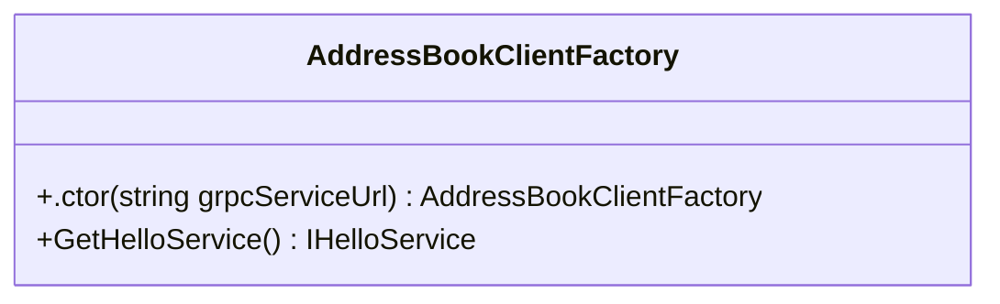

##### `AutofacHelper` class diagram

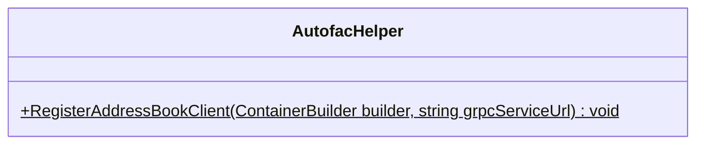

##### `IHelloMessage` class diagram

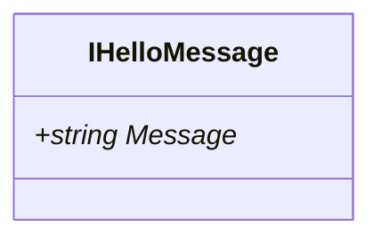

##### `IHelloService` class diagram

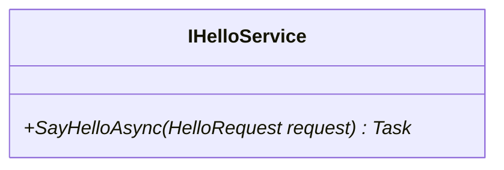

##### `HelloMessage` class diagram

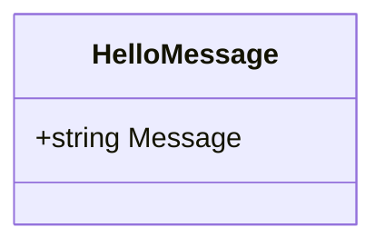

##### `HelloRequest` class diagram

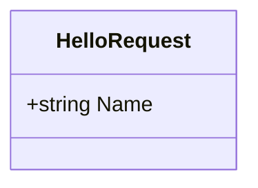

##### `ApplicationLifetimeManager` class diagram

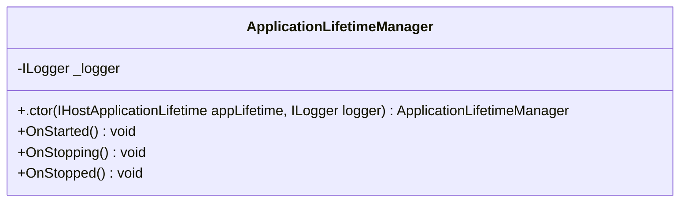

##### `Program` class diagram

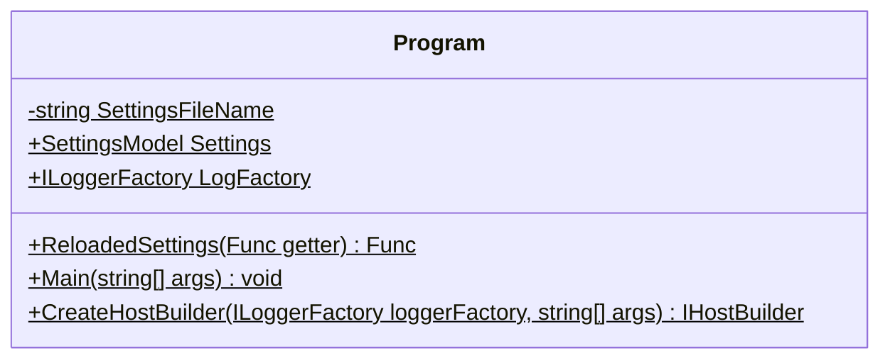

##### `Startup` class diagram

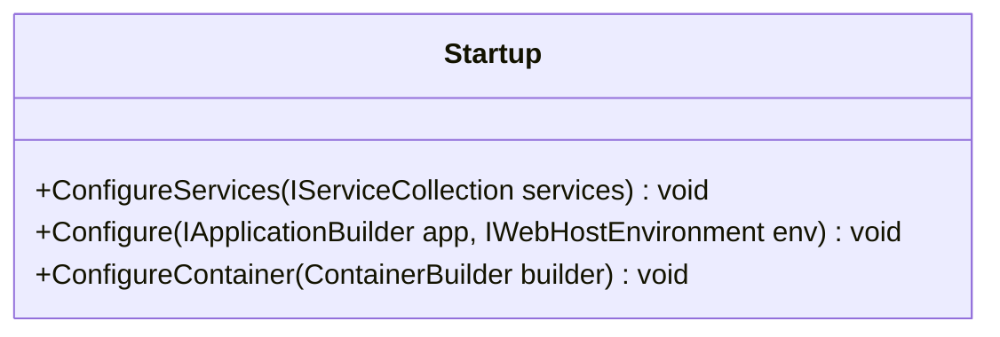

##### `ServiceModule` class diagram

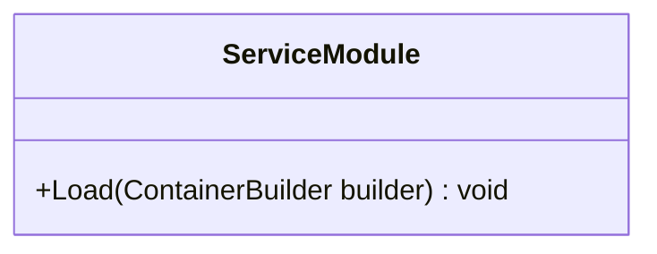

##### `SettingsModule` class diagram

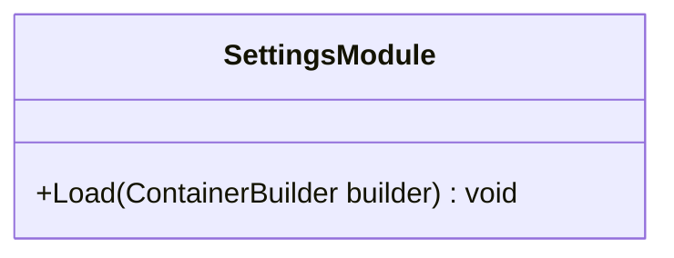

##### `HelloService` class diagram

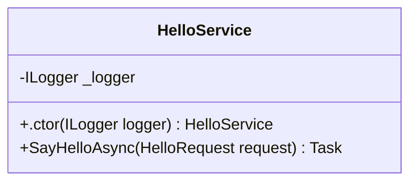

##### `SettingsModel` class diagram

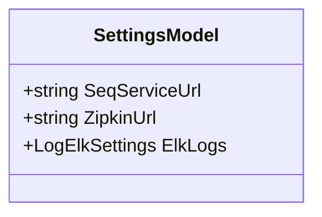

*This file is maintained by a bot.*

<!-- markdownlint-restore -->
